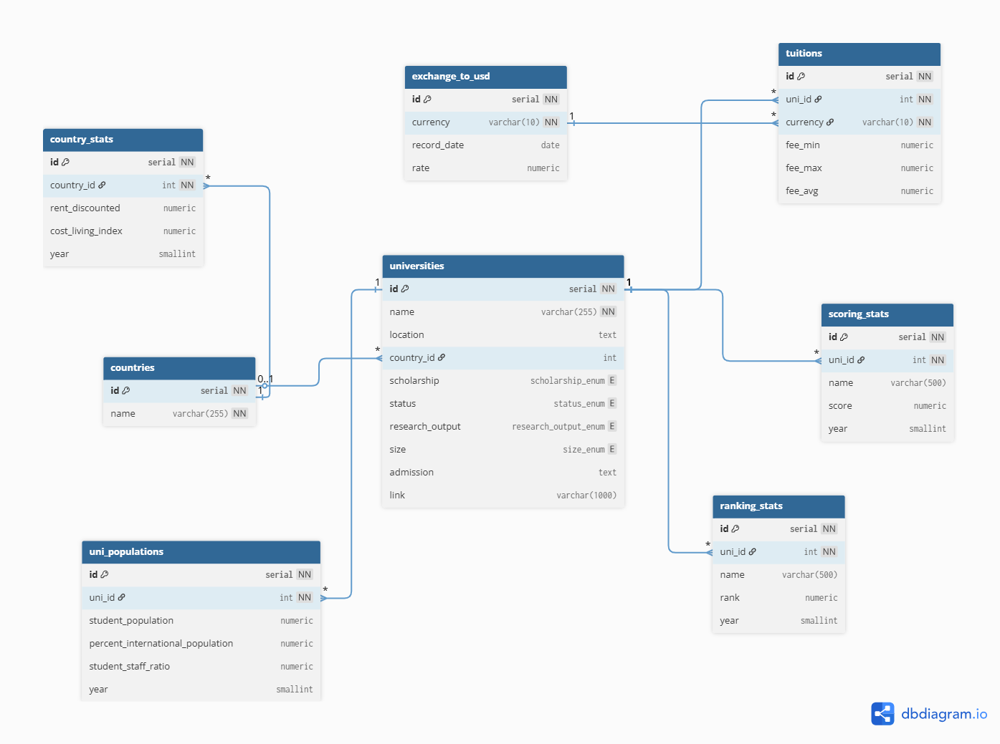

# Design Document

By Van Tran (Hazel)

Video overview: [Watch here](<https://youtu.be/Qa60PZPE32I>)

---

## Scope

**Purpose of the database** \
The purpose of this database is to support a study abroad agency in managing and presenting information about universities worldwide. It allows advisors and parents to compare tuition costs, living expenses, college evaluations, and university rankings across multiple countries. The system is designed to provide accurate, reliable, and parent-friendly insights.

**In scope**
- Universities and core attributes (name, location, country, scholarship, status, research output, size, admissions info, link).
- Tuition data per university in local currency (min/max/avg).
- Exchange rates to USD with historical records by date.
- University rankings (by source and year) and scoring statistics (evaluations of experts on the college on many aspects).
- Country-level statistics (cost of living index, rent, year).
- University student populations and international student percentages.
- Read-optimized projections for parents/advisors (views and materialized views).

**Out of scope**
- Individual student applications, personal data, visa processes.
- Course- or program-level tuition (this design is at the university level).
- Real-time exchange rates; exchange rates are stored as daily rates.
- Employment outcomes, alumni data, or admissions decisions.

---

## Functional Requirements

**What users should be able to do**
- Search and browse universities by name, country, size, research output, or status.
- Compare tuition across countries in USD using the recent exchange rate.
- Combine tuition and living costs to estimate annual study costs by country.
- Identify universities with high international student shares or favorable student–staff ratios.
- Produce parent-friendly shortlists that include: university, rank, score, and USD tuition.
- Support analyst reporting: top-N rankings, affordability by country, trends in international students.

**Out of scope**
- Submitting admissions applications or managing offers.
- Real-time integrations with immigration/visa systems.
- Personalized AI matching (future extension).
- City-level cost breakdowns (design uses country-level stats).

---

## Representation

### Entities

**Enumerated Types**
- `status_enum`: Public, Private.
- `research_output_enum`: Very High, High, Medium, Low.
- `size_enum`: S, M, L, XL.
- `scholarship_enum`: Yes, No.
These domain types enforce consistent categorical values across the dataset and improve query clarity.

**Countries**
- Attributes: `id`, `name`.
- Types/constraints: integer PK; `name` unique, non-null.
- Rationale: id reference for country names.

**Country Stats**
- Attributes: `id`, `country_id`, `rent_discounted`, `cost_living_index`, `year`.
- Types/constraints: `country_id` is FK to `countries(id)`.
- Rationale: stores living cost stats needed for affordability analysis; one row per country per year.

**Universities**
- Attributes: `id`, `name`, `location`, `country_id`, `scholarship`, `status`, `research_output`, `size`, `admission`, `link`.
- Types/constraints: `id` integer PK; `country_id` FK reference to `countries(id)`; enums for categorical fields; URLs stored as text.
- Rationale: central entity for all university-level comparisons.

**University Populations**
- Attributes: `id`, `uni_id`, `student_population`, `percent_international_population`, `student_staff_ratio`, `year`.
- Types/constraints: `uni_id` FK to `universities(id)`; numeric KPls; year as small integer.
- Rationale: supports trend and destination openness analyses.

**Scoring Stats**
- Attributes: `id`, `uni_id`, `name`, `score`, `year`.
- Types/constraints: `uni_id` FK to `universities(id)`; score numeric; year small integer.
- Rationale: stores the expert evaluations (as scores over 100) on different aspects of a university (e.g. employment opportunities, research network, etc.) per year to form league tables beyond ranks.

**Ranking Stats**
- Attributes: `id`, `uni_id`, `name` (source), `rank`, `year`.
- Types/constraints: `uni_id` FK to `universities(id)`; rank numeric; year small integer.
- Rationale: captures different ranking metrics and the ranks by year.

**Exchange to USD**
- Attributes: `id`, `currency`, `record_date`, `rate`.
- Types/constraints: `currency` short text (ISO-like code or label); `record_date` date; `rate` numeric.
- Rationale: historical FX table for converting local tuition to USD. Currency is modeled as text to avoid an extra dimension table.

**Tuitions**
- Attributes: `id`, `uni_id`, `currency`, `fee_min`, `fee_max`, `fee_avg`.
- Types/constraints: `uni_id` FK to `universities(id)`; currency short text; fees numeric.
- Rationale: stores local-currency tuition summaries; combined with FX for USD comparisons.

### Relationships

- Countries `1 ──<` Universities (each university belongs to exactly one country).
- Countries `1 ──<` Country Stats (one row per country per year).
- Universities `1 ──<` Tuitions (usually one row per university; model allows multiple if needed).
- Universities `1 ──<` University Populations (potentially multiple years).
- Universities `1 ──<` Scoring Stats (by metric name and year).
- Universities `1 ──<` Ranking Stats (by source and year).
- Ranking Stats `1 ──<` Ranking History (log of changes; maintained by trigger).

---

## Optimizations

**Indexes (operational and analytical speed)**
- `universities(name)`: fast text search by university name.
- `countries(name)`: fast country lookup and joins.
- `ranking_stats(rank)`: quick ordering/filtering by rank.
- `ranking_stats(uni_id, year)`: efficient time-series lookups per university.
- `country_stats(country_id, rent_discounted)`: country affordability analytics.
- Materialized view index: `tuitions_usd(uni_id, fee_usd_avg)`: common “fee under X” filters.

**Views and Materialized Views**
- **Materialized View: `tuitions_usd`**
  - Purpose: precomputes USD tuition (`fee_usd_avg`) from `tuitions` × latest `exchange_to_usd`.
  - Benefit: eliminates repeated FX joins for parent-facing queries; supports indexing.
  - Refresh: concurrent refresh after tuition changes.

- **View: `general_view`**
  - Purpose: parent/advisor-friendly projection combining universities, latest QS ranking, and USD tuition.
  - Columns (conceptual): `uni_id`, `uni_name`, `country_id`, `country_name`, `rank`, `fee_usd_avg`, `scholarship`, `status`, `research_output`, `size`.
  - Benefit: an overall, beginner-friendly, comprehensive view on all important information of universities.

- **View: `top20_int_population`**
  - Purpose: showcases institutions with the highest international student share (e.g., for a target year).
  - Benefit: helps advisors highlight destinations welcoming international students to open partnerships.

**Triggers**
- **Auto-refresh USD MV**: after insert/update/delete on `tuitions`, refresh `tuitions_usd` concurrently.
- **Prevent duplicate FX rows**: before insert on `exchange_to_usd`, reject duplicates of `(currency, record_date)` to avoid overloading the exchange rates table unnecessarily.
- **Log ranking changes**: after update on `ranking_stats`, when `rank` changes, append a row to `ranking_history`.

**Why these choices**
- Materialized view + index for USD conversion addresses the most common and heavy request (parents comparing fees). It also indexes to work upon to optimize performance.
- Auto refresh ensures the view updates the latest information.
- FX duplication control ensures a single rate per currency/day as exchange rates do not fluctuate too much.
- Ranking history adds context and extra evaluation for advisors and parents.

---

## Limitations

- Tuition is at the university level; program-level fees are not included, which may reduce precision for specific majors.
- Living costs are at the country level; city-level variations (e.g., capital vs. smaller city) are not captured.
- Different ranking sources use different methodologies; this design stores them side-by-side without normalization of methodology.
- Materialized views require refresh; if not scheduled or triggered properly, USD fees may temporarily lag.
- Accurate rank/score trends depend on consistent update of information.

---
